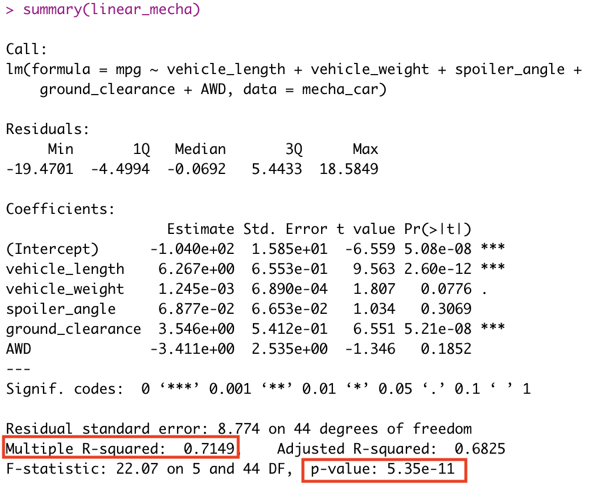
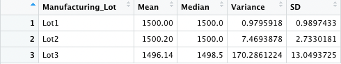
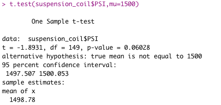
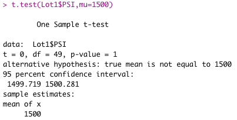
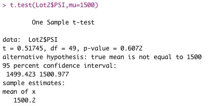
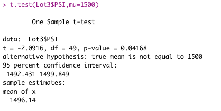

# MechaCar Statistical Analysis
## Linear Regression to Predict MPG
 

*	Which variables/coefficients provided a non-random amount of variance to the mpg values in the dataset?

Response: Based on the results above, vehicle length and ground clearance have significant impact on the impact, since both t values are high. 

*	Is the slope of the linear model considered to be zero? Why or why not?

Response: No, the slope of the linear model is not considered to be zero. The p-value of our linear regression analysis is 5.35e-11, which is much smaller than our assumed significance level of 0.05%. Therefore, we can state that there is sufficient evidence to reject our null hypothesis, which means that the slope of our linear model is not zero.

*	Does this linear model predict mpg of MechaCar prototypes effectively? Why or why not?

Response: From our linear regression model, the r-squared value is 0.71, which means that roughly 71% of the variability of our dependent variable (mpg) is explained using this linear model.

## Summary Statistics on Suspension Coils

###  Total Summary

The Total Summary table below summarizes the mean, median, variance and standard deviation for all the vehicles in three lots.
  

### Lot Summary

The Lot Summary table below summarizes the mean, median, variance and standard deviation for each lot.

According to the data results, only Lot1 and Lot2 meet the design specification of the suspension coils not exceeding 100 pounds per square inch. Lot 3 data shows 170 pounds per square inch deviation, which is significantly higher than the design specification.

### T-Tests on Suspension Coils
PSI across all manufacturing lots VS the population mean of 1,500 pounds per square inch
 

Based on the results above, the mean of the three slots is 1498.78. The p-value is 0.06028 which is greater than our significance value of 0.05, as such we don’t have enough evidence to reject the null hypothesis.

### PSI for Lot 1 VS the population mean of 1,500 pounds per square inch 

The mean of lot 1 is 1500 which is the same as the population mean of 1,500. In addition, the p-value is 1, which means that there is no difference between the two datasets.

### PSI for Lot 2 VS the population mean of 1,500 pounds per square inch

Based on the results above, the mean of the three slots is 1500.2. The p-value is 0.0672 which is greater than our significance value of 0.05, as such we don’t have enough evidence to reject the null hypothesis.

### PSI for Lot 3 VS the population mean of 1,500 pounds per square inch 

Based on the results above, the mean of the three slots is 1496.14. The p-value is 0.04168 which is smaller than our significance value of 0.05, as such we do have enough evidence to reject the null hypothesis.

